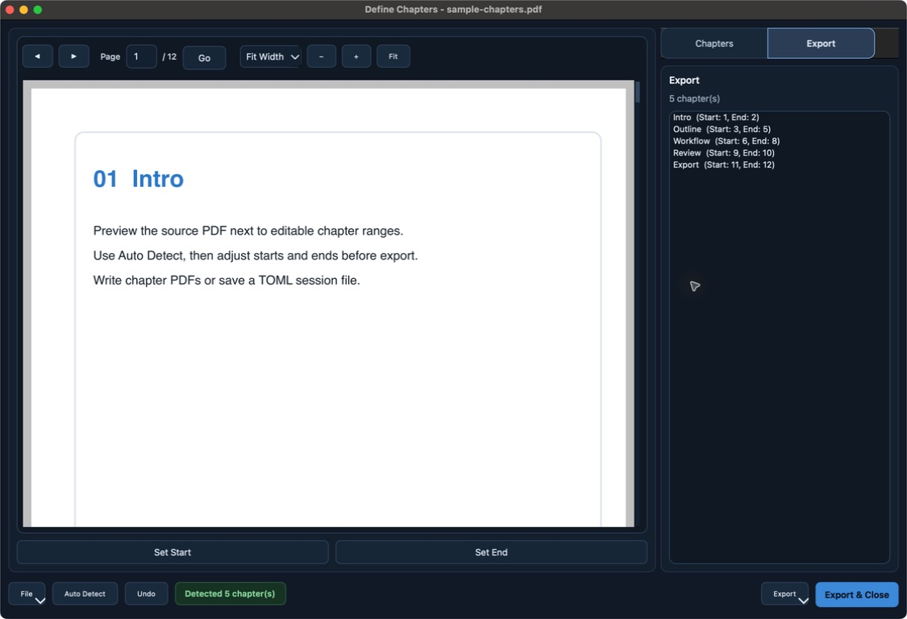

# PDF Chapter Splitter

Turn one long PDF into clean, individually named chapter files. Review detected boundaries beside
the document, correct anything that needs attention, and export without uploading the source PDF.

<p align="center">
  <a href="https://pdf-chapter-splitter.young-hen-7947.chatgpt.site/"><strong>Try the browser showcase</strong></a>
  ·
  <a href="https://github.com/hydroLB/Chapter_Splitter/releases/latest"><strong>Download the desktop app</strong></a>
  ·
  <a href="#command-line"><strong>Use the CLI</strong></a>
</p>

<p align="center">
  <a href="https://github.com/hydroLB/Chapter_Splitter/actions/workflows/ci.yml"></a>
  
  
  
</p>



The browser showcase runs locally in the browser: choose a PDF, edit chapter ranges, preview pages,
and export the result. The downloadable app is the full native Qt application and includes the CLI.

## What it does

- Detects chapters from PDF outlines, then falls back to a table of contents when configured.
- Keeps the PDF preview and editable chapter ranges in one keyboard-accessible window.
- Exports a complete set transactionally, rolling back partial output after ordinary write failures.
- Prevents accidental overwrites with atomic no-clobber commits and portable filename collision checks.
- Saves and imports chapter maps as readable TOML for repeatable or scripted work.

PDFs are processed on the user’s machine. The desktop app has no account, telemetry service, or
upload endpoint.

## Download

Download the archive for macOS, Windows, or Linux from the
[latest release](https://github.com/hydroLB/Chapter_Splitter/releases/latest). Each archive has a
matching SHA-256 file. The current community builds are automated and unsigned, so macOS Gatekeeper
or Windows SmartScreen may ask for confirmation. The release notes identify this explicitly.

To run from source on macOS or Linux:

```bash
git clone https://github.com/hydroLB/Chapter_Splitter.git
cd Chapter_Splitter
./start
```

The first run creates an isolated `.venv` and installs the pinned Python and Qt dependencies.

## Desktop workflow

1. Choose a PDF.
2. Let Auto Detect populate the chapter list.
3. Review titles and page ranges beside the preview. `Set Start` and `Set End` apply the current page
   to the selected chapter.
4. Export the chapter PDFs, a TOML map, or a reusable session.

Useful shortcuts: `Ctrl+D` auto-detects, `Ctrl+Z` restores the previous detected list, `Ctrl+E`
exports, and `Ctrl+Enter` validates, exports, and closes.

## Command line

Install the base package without Qt when only automation is needed:

```bash
python -m pip install .
chapter-splitter --version
chapter-splitter detect --pdf book.pdf --out chapters.toml
chapter-splitter split --pdf book.pdf --chapters chapters.toml
```

Chapter maps stay intentionally simple:

```toml
[[chapters]]
title = "Introduction"
start_page = 1
end_page = 8

[[chapters]]
title = "Methods"
start_page = 9
end_page = 24
```

Run `chapter-splitter --help` for collision policies, page offsets, and detection strategies.

## Engineering notes

The Qt app and CLI call the same typed detection, validation, and export services. PDF and TOML
writes stage data before committing it; batch PDF export also removes already committed outputs when
a later ordinary filesystem operation fails. Cooperative cancellation keeps the interface responsive
during detection and export without claiming that third-party parser calls can be interrupted safely.

The default quality gate runs Ruff, strict mypy, import-boundary checks, branch-aware pytest coverage,
Bandit, pip-audit, package builds, and release consistency checks:

```bash
make install-desktop
make check
```

CI additionally verifies the wheel in an isolated environment, exercises Qt offscreen, scans the
full Git history for secrets, and smoke-tests standalone bundles. See
[architecture](docs/architecture.md), [threat model](docs/threat-model.md), and
[release process](RELEASE.md) for the focused implementation details.

## Known limits

- Image-only scans need OCR before TOC fallback can read them.
- Password-protected or malformed PDFs may be rejected by the underlying parser.
- Cancellation is cooperative while a PDF library call is in progress.
- Automated desktop builds are not currently notarized or code-signed with a publisher certificate.

Please use [GitHub issues](https://github.com/hydroLB/Chapter_Splitter/issues) for reproducible bugs.
Sensitive reports should use GitHub’s private vulnerability reporting form.

## License

MIT. Bundled dependency notices are listed in [THIRD_PARTY_NOTICES.md](THIRD_PARTY_NOTICES.md).
