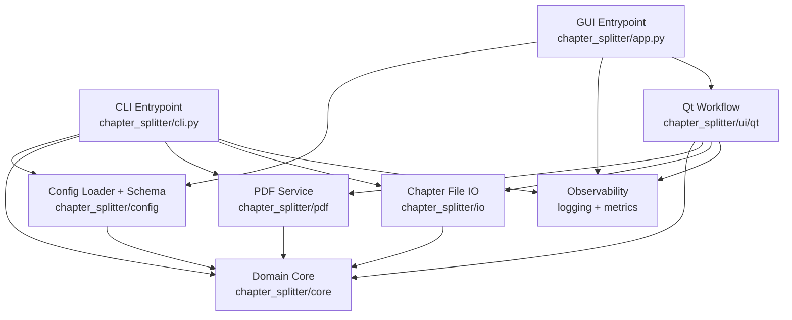

# Architecture

## Goal

Chapter Splitter keeps domain logic independent from user interfaces and packaging concerns so the
same core workflow is reusable from CLI, GUI, tests, and benchmarks.

## High-Level Structure

- `chapter_splitter/core`: domain models, validation, runtime cancellation, error taxonomy
- `chapter_splitter/config`: typed settings load/merge/validation
- `chapter_splitter/pdf`: PDF IO, chapter detection, chapter splitting
- `chapter_splitter/io`: chapter TOML/session file IO
- `chapter_splitter/observability`: structured logging, correlation IDs, metrics hooks
- `chapter_splitter/ui/workflow_validation.py`: Qt-free session and export-readiness policies
- `chapter_splitter/cli.py`: command entrypoint boundary
- `chapter_splitter/app.py` + `chapter_splitter/ui/qt`: desktop boundary

## Dependency Direction

- domain core is lowest-level and has no UI dependency
- service modules depend on core (`config`, `pdf`, `io`, `observability`, `utils`)
- interface modules (`app`, `cli`, `ui`) depend on service/core layers
- CI enforces the boundary contract with `make boundaries`

## Main Runtime Flows

### Split Flow

1. entrypoint loads typed settings
2. chapter definitions are loaded and validated
3. PDF reader loads with timeout/retry/cancellation checks
4. chapter ranges map to output paths with collision policy
5. every chapter is serialized to a hidden staging file beside its destination
6. the batch commits with per-file atomic primitives and reverse-order rollback for ordinary
   filesystem failures; no-clobber mode uses link-based installation so a target created after
   planning is not overwritten
7. results are logged with correlation metadata

The batch cannot be made atomic as one cross-platform filesystem operation. Abrupt process or
machine termination during the multi-file commit window may leave a partial batch even though
ordinary commit errors trigger rollback.

### Detect Flow

1. entrypoint loads settings and source PDF
2. outlines strategy runs first, optional TOC fallback runs second
3. detection report is returned with strategy/confidence/warnings
4. optional TOML/session export persists detected chapters

### Session Import Flow

1. chapter TOML and optional session metadata are parsed without importing Qt
2. recorded page count is checked against the loaded PDF
3. out-of-document ranges are rejected before visible table state changes
4. a differing recorded PDF path requires explicit user confirmation
5. export readiness reuses the same core validation policy as the split pipeline

### Qt Work Scheduling

- detection and chapter-PDF export run in owned `QThread` workers so the Qt event loop stays active
- worker results and errors return through queued signals and update widgets on the GUI thread
- repeated long-running actions are suppressed while a worker is active
- progress-dialog cancellation sets a shared cancellation token; operation deadlines use the same
  checkpoint model

Cancellation and deadlines are cooperative. They are observed at application checkpoints and do
not terminate a thread or forcibly interrupt a blocking `pypdf` call already in progress.

## Observability and Error Contract

- structured logs are JSON with stable keys (timestamp/level/logger/message/correlation_id/event)
- redaction traverses nested mappings and sequences, handles cycles, and also sanitizes exception
  type/message/traceback diagnostics
- domain exceptions carry typed error codes
- centralized mapper converts exceptions into:
  - log event and log level
  - stable process exit semantics
  - structured error fields (`error_code`, `exit_code`, `location`)

## Packaging Boundary

The base wheel contains the CLI and domain services with `pypdf` as its only runtime dependency.
PySide6 is isolated in the `desktop` extra and imported lazily, so CLI-only installs remain usable.
The `bundle` extra includes both the desktop runtime and PyInstaller tooling. CI installs the built
wheel into an isolated environment and verifies both the CLI path and the intentional missing-Qt
error contract before running a separate headless desktop smoke job. The standalone builder declares
the lazily loaded Qt workflow explicitly, then launches the result and requires its structured
`app_started` event; artifact existence alone is not treated as a successful release.

## Diagram

