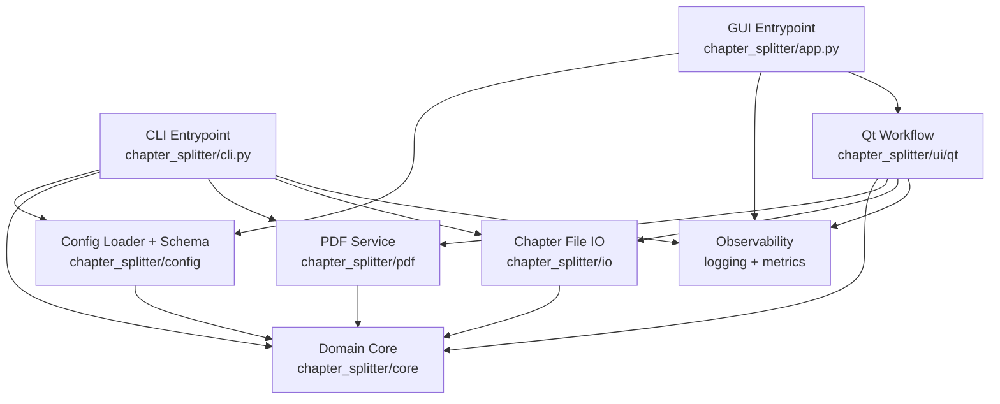

# Architecture

## Goal

Chapter Splitter keeps domain logic independent from user interfaces and packaging concerns so the
same core workflow is reusable from CLI, GUI, tests, and benchmarks.

## High-Level Structure

- `chapter_splitter/core`: domain models, validation, runtime cancellation, error taxonomy
- `chapter_splitter/config`: typed settings load/merge/validation
- `chapter_splitter/pdf`: PDF IO, chapter detection, chapter splitting
- `chapter_splitter/io`: chapter TOML/session file IO
- `chapter_splitter/observability`: structured logging, correlation IDs, metrics hooks
- `chapter_splitter/cli.py`: command entrypoint boundary
- `chapter_splitter/app.py` + `chapter_splitter/ui/qt`: desktop boundary

## Dependency Direction

- domain core is lowest-level and has no UI dependency
- service modules depend on core (`config`, `pdf`, `io`, `observability`, `utils`)
- interface modules (`app`, `cli`, `ui`) depend on service/core layers
- CI enforces the boundary contract with `make boundaries`

## Main Runtime Flows

### Split Flow

1. entrypoint loads typed settings
2. chapter definitions are loaded and validated
3. PDF reader loads with timeout/retry/cancellation checks
4. chapter ranges map to output paths with collision policy
5. outputs are written atomically and logged with correlation metadata

### Detect Flow

1. entrypoint loads settings and source PDF
2. outlines strategy runs first, optional TOC fallback runs second
3. detection report is returned with strategy/confidence/warnings
4. optional TOML/session export persists detected chapters

## Observability and Error Contract

- structured logs are JSON with stable keys (timestamp/level/logger/message/correlation_id/event)
- domain exceptions carry typed error codes
- centralized mapper converts exceptions into:
  - log event and log level
  - stable process exit semantics
  - structured error fields (`error_code`, `exit_code`, `location`)
- metrics hooks are backend-agnostic (`MetricsSink`) with `NoOpMetrics` default

## Diagram

